# Oloids
This project contains the scripts, STL files, Fusion 360 source files and other media relating to my video on [Oloids](https://en.wikipedia.org/wiki/Oloid).  It will be appearing soon on my YouTube channel [Make It Down To Earth](https://www.youtube.com/channel/UCGBt41ue4j5QFqwPg0efcfQ)

The [fusion360](fusion360) directory contains the Fusion 360 source files for the custom oloid designs featured in the video.  The [stl](stl) directory contains the STL files for those design if you just want to print them.  See below for pictures/renderings of the models.

The [scripts](scripts) directory contains a Perl script that will
generate an STL file containing an Oloid.  See the comments in the
code for information on how to install the required modules and then
run the script.

You can specify the circle radius and the number of samples points as
command line arguments or enter the values when prompted.  Note that the
length of the Oloid will be 3 times the circle radius.  The default
radius of 33.333mm gives a 100mm Oloid.  The default number of samples
is 30.  The number of facets generated will be 12 times this value,
e.g. 12 x 30 = 480.

The [models](models) directory contains some example STL files generated
by the script.  These are basic solid oloids.  You should be able to import these directly into your 3d modelling software for further manipulation.

### Basic Oloid STL Model
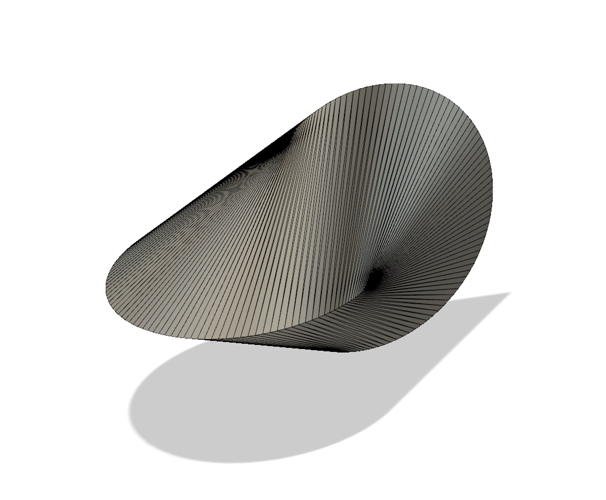

## Custom Disc Oloids

### Brainbox Disc Oloid
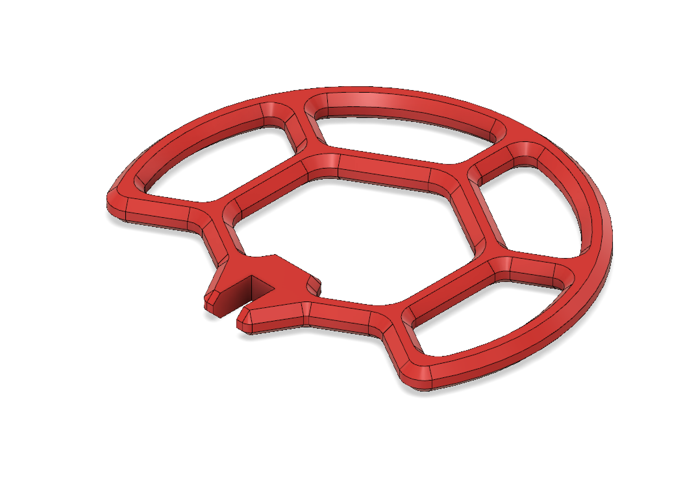

### Honeycomb Disc Oloid
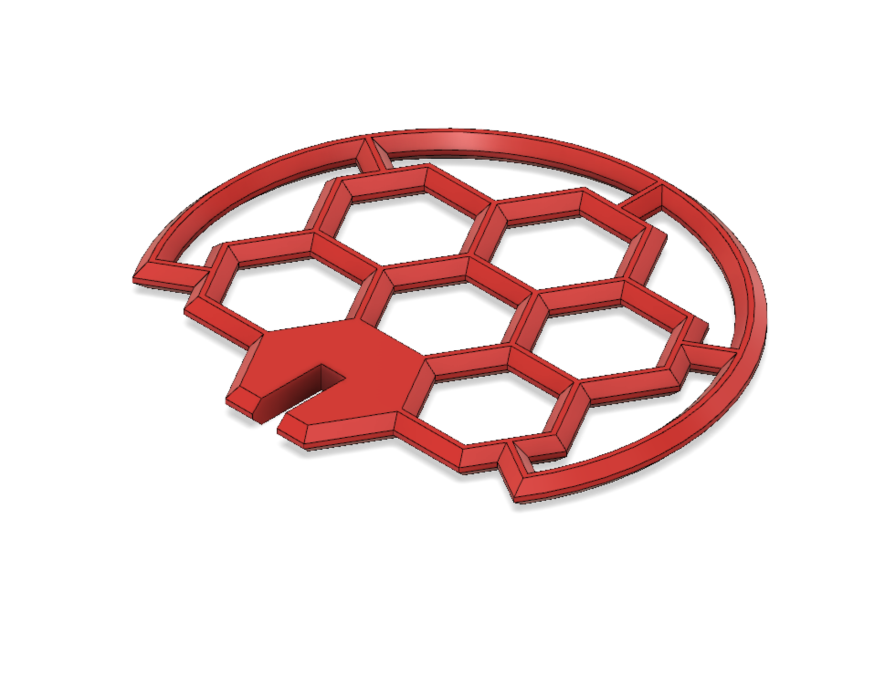

### Halloween Disc Oloid
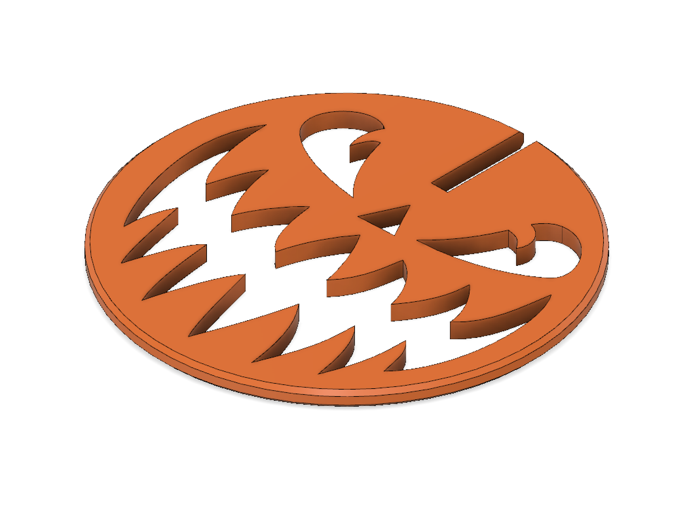

## Custom Solid Oloids

### Cookie Cut Cog Oloid
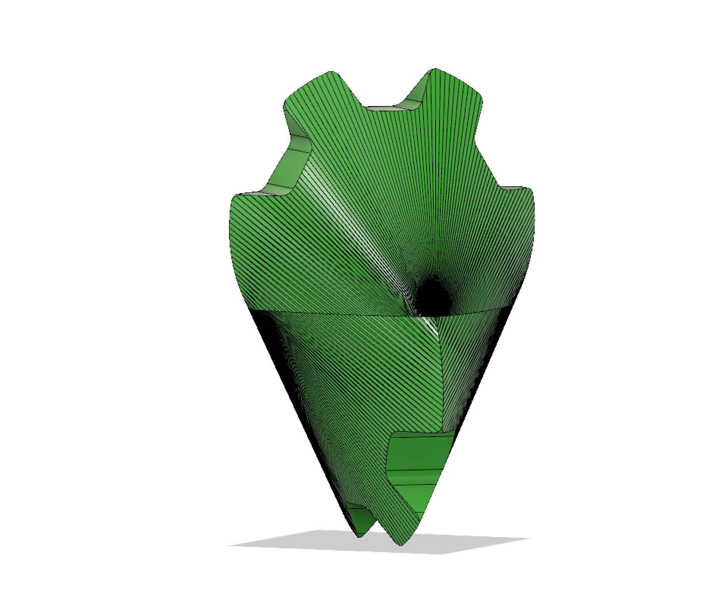

### Interlocked Cogs Oloid
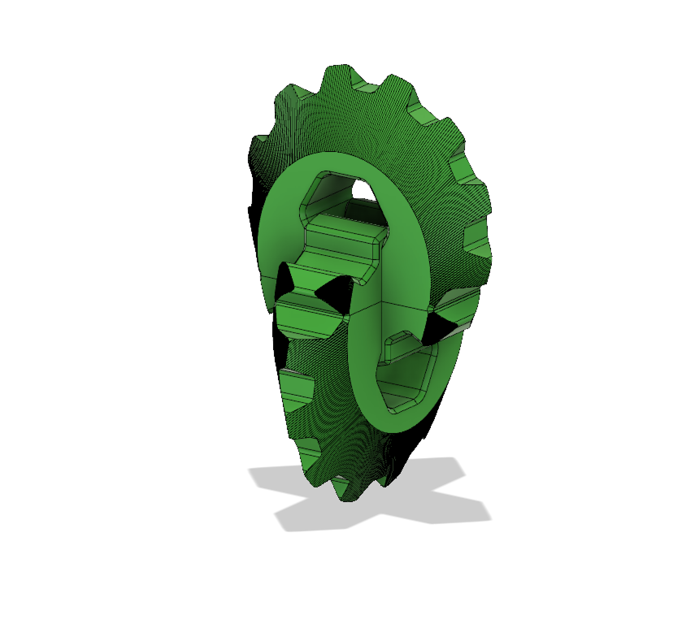

### Edge Carve Oloid
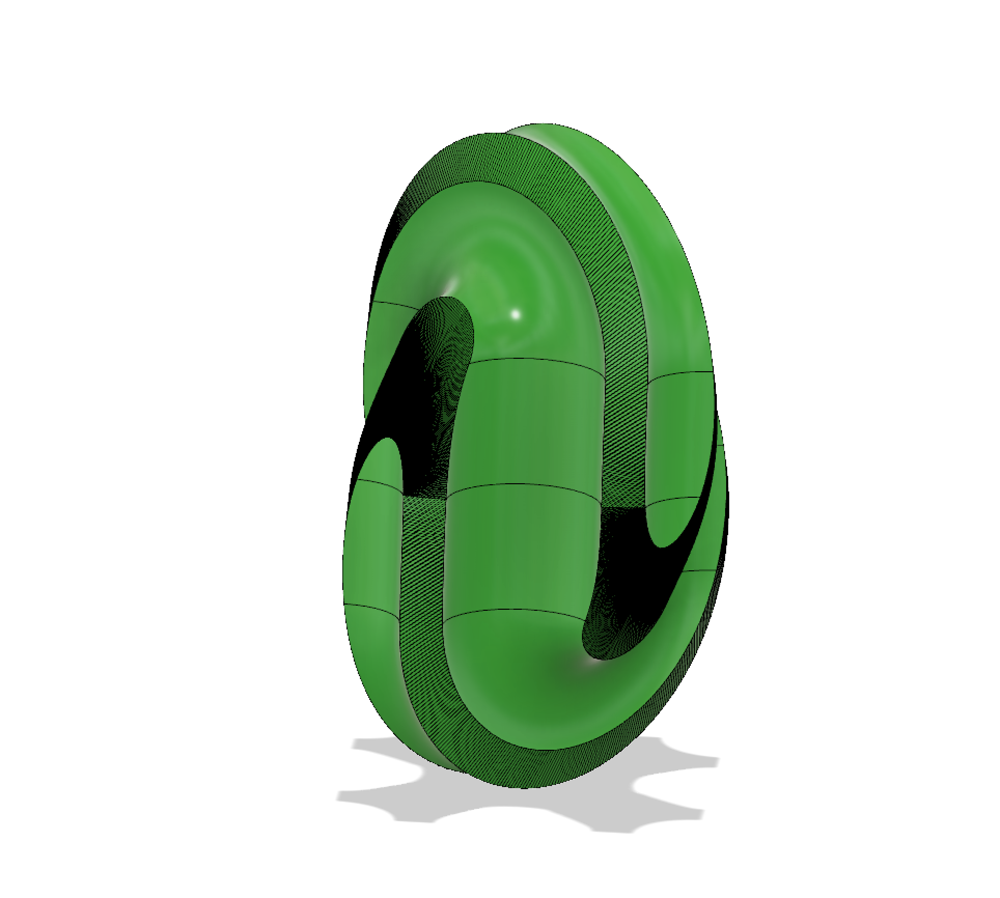

### Square Foil Oloid
This can be printed upright in a single part.
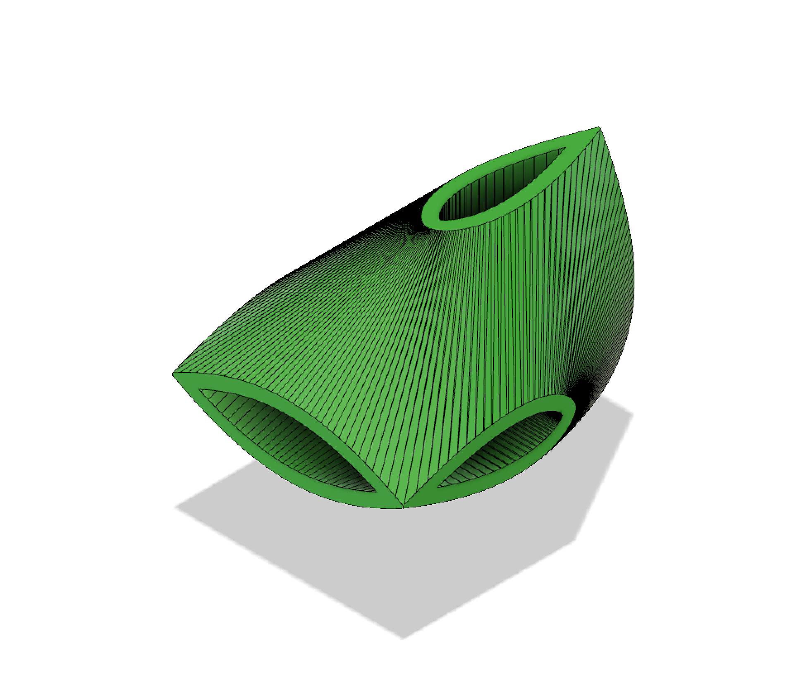

### Fern Oloid #1
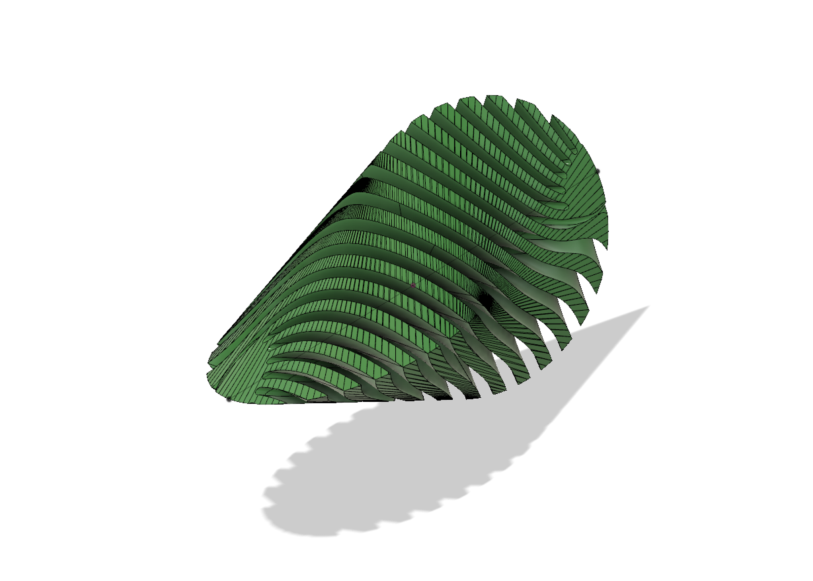

### Fern Oloid #2
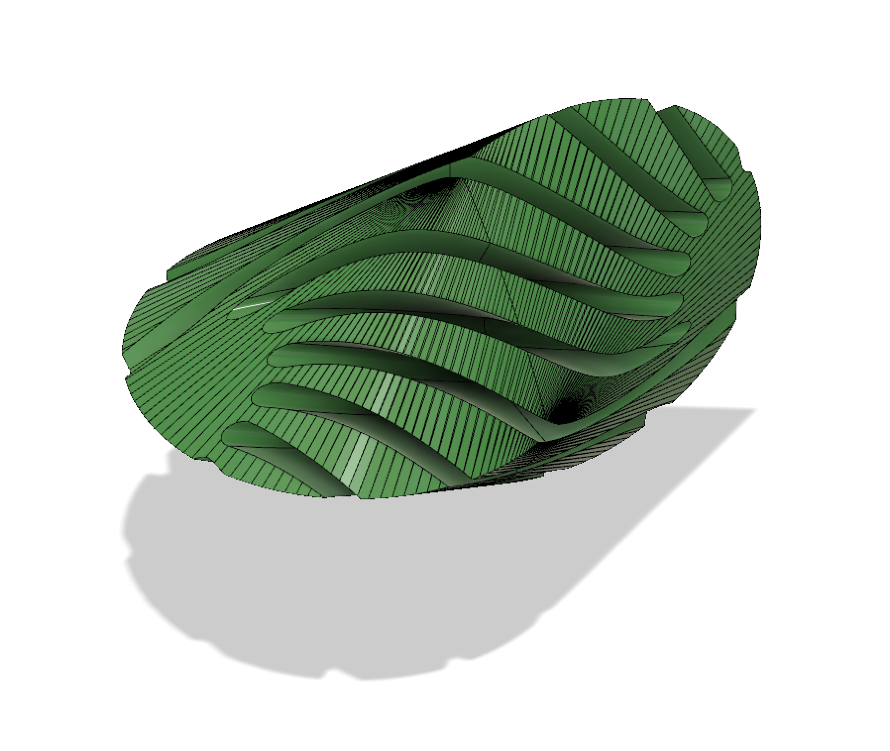

### Multipart Oloid
Printed in separate parts that push together.

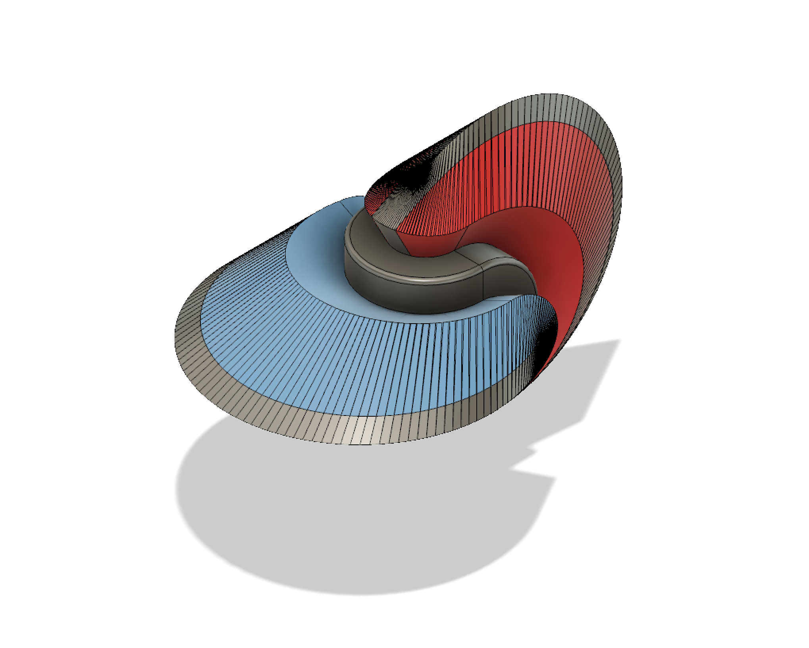

